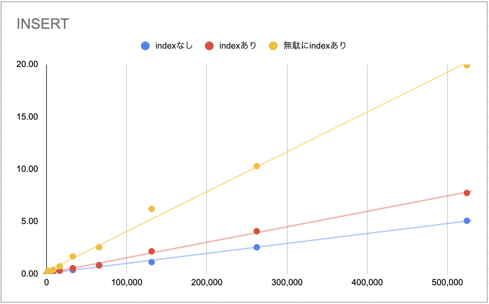
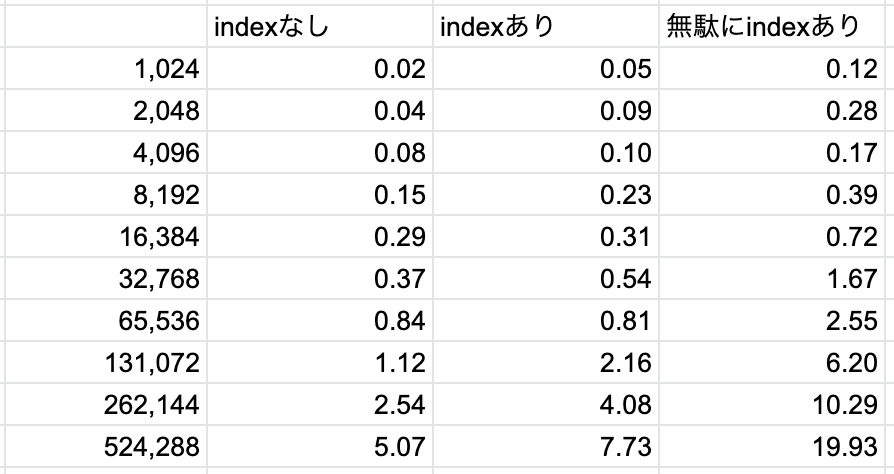
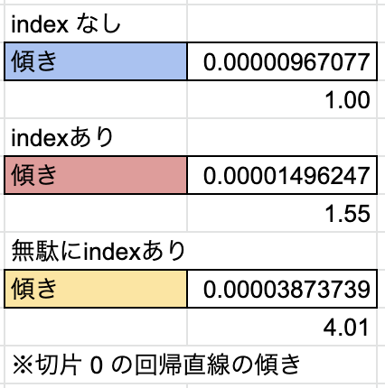

# MySQL でのパフォーマンス測定
普段パフォーマンスを気にしながらインデックスを貼ったりクエリを投げているわけですが、無頓着だとどれくらい差がでるのか気になったので計測してみます。

# 計測
## 計測方法
- 単純に `Query OK, xxx rows affected (x min x.xx sec)` の時間を見ています
- ただ、時間が短くシビアなものについては `performance_schema` スキーマを確認しています

## INSERT
### テーブル
#### index なし
```
CREATE TABLE item
(
    id   INT PRIMARY KEY AUTO_INCREMENT,
    num  INT UNSIGNED,
    str  VARCHAR(30),
    str2 VARCHAR(30),
    str3 VARCHAR(30)
);
```

#### index あり
```
CREATE TABLE item_index
(
    id   INT PRIMARY KEY AUTO_INCREMENT,
    num  INT UNSIGNED,
    str  VARCHAR(30),
    str2 VARCHAR(30),
    str3 VARCHAR(30),
    index (num),
    index (str)
);
```

#### 無駄に index あり
```
CREATE TABLE item_index_2
(
id   INT PRIMARY KEY AUTO_INCREMENT,
num  INT UNSIGNED,
str  VARCHAR(30),
str2 VARCHAR(30),
str3 VARCHAR(30),
index (num),
index (str),
index (str2),
index (str3),
index (str, str2),
index (str, str3),
index (str2, str3),
index (str, str2, str3),
index (str, str3, str2),
index (str2, str, str3),
index (str2, str3, str),
index (str3, str2, str)
);
```

### 結果





## UPDATE
- 同じテーブルに対して UPDATE かけました。
- テストデータの id が綺麗じゃなかったので LIMIT を使って UPDATE 件数を指定しています(ので、通常よりパフォーマンスは落ちていると思われます)

### 結果


