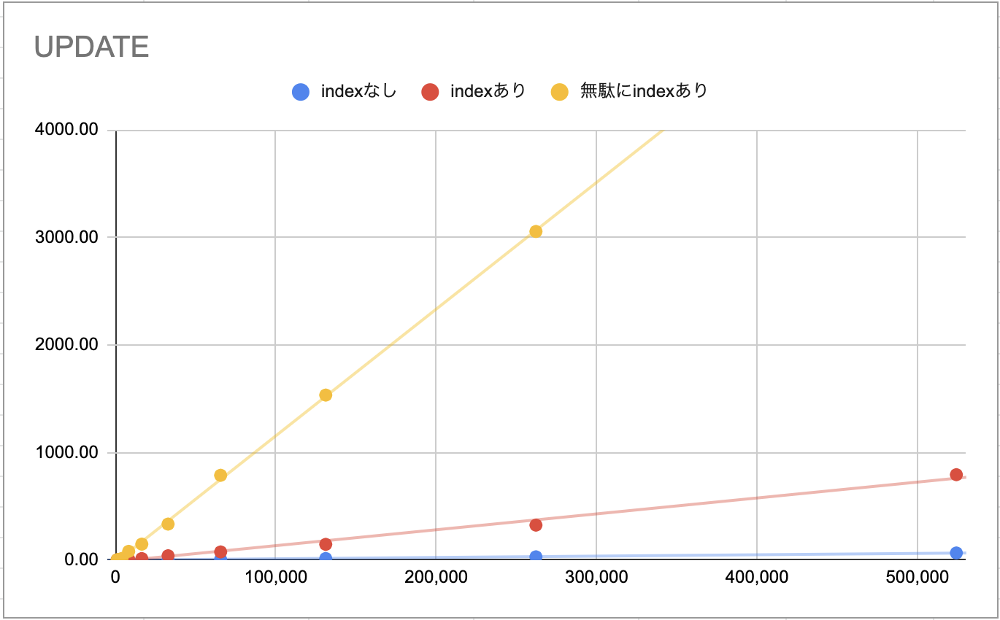
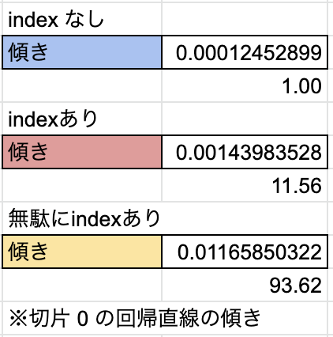

# MySQL でのパフォーマンス測定
- 普段パフォーマンスを気にしながらインデックスを貼ったりクエリを投げているわけですが、無頓着だとどれくらい差がでるのか気になったので計測してみます
- 実務のデータ数でこれまで体感できなかった為、実際に差が出るのか？を試してみたかったというのが経緯です

# 計測
## 計測方法
- 単純に `Query OK, xxx rows affected (x min x.xx sec)` の時間を見ています
- ただ、時間が短くシビアなものについては `performance_schema` スキーマを確認しています

## INSERT
### テーブル
#### index なし
```
CREATE TABLE item
(
    id   INT PRIMARY KEY AUTO_INCREMENT,
    num  INT UNSIGNED,
    str  VARCHAR(30),
    str2 VARCHAR(30),
    str3 VARCHAR(30)
);
```

#### index あり
```
CREATE TABLE item_index
(
    id   INT PRIMARY KEY AUTO_INCREMENT,
    num  INT UNSIGNED,
    str  VARCHAR(30),
    str2 VARCHAR(30),
    str3 VARCHAR(30),
    index (num),
    index (str)
);
```

#### 無駄に index あり
```
CREATE TABLE item_index_2
(
id   INT PRIMARY KEY AUTO_INCREMENT,
num  INT UNSIGNED,
str  VARCHAR(30),
str2 VARCHAR(30),
str3 VARCHAR(30),
index (num),
index (str),
index (str2),
index (str3),
index (str, str2),
index (str, str3),
index (str2, str3),
index (str, str2, str3),
index (str, str3, str2),
index (str2, str, str3),
index (str2, str3, str),
index (str3, str2, str)
);
```

### 結果


## UPDATE
- 同じテーブルに対して UPDATE かけました。
- テストデータの id が綺麗じゃなかったので LIMIT を使って UPDATE 件数を指定しています(通常よりパフォーマンスは落ちていると思われます)

### 結果






## 絞り込むタイミング
### 1条件目であまり絞り込めていない場合
```
mysql> SELECT EVENT_ID,
    ->        TRUNCATE(TIMER_WAIT / 1000000000000, 6) AS Duration,
    ->        SQL_TEXT
    -> FROM performance_schema.events_statements_history_long
    -> WHERE SQL_TEXT = "select * from item where str like '%2%' and str2 like '%525%'";
+----------+----------+---------------------------------------------------------------+
| EVENT_ID | Duration | SQL_TEXT                                                      |
+----------+----------+---------------------------------------------------------------+
|      532 | 0.758868 | select * from item where str like '%2%' and str2 like '%525%' |
|      627 | 0.734291 | select * from item where str like '%2%' and str2 like '%525%' |
|      646 | 0.731736 | select * from item where str like '%2%' and str2 like '%525%' |
|      665 | 0.784295 | select * from item where str like '%2%' and str2 like '%525%' |
|      684 | 0.699200 | select * from item where str like '%2%' and str2 like '%525%' |
|      817 | 0.726403 | select * from item where str like '%2%' and str2 like '%525%' |
|      836 | 0.665074 | select * from item where str like '%2%' and str2 like '%525%' |
|      855 | 0.669399 | select * from item where str like '%2%' and str2 like '%525%' |
|      874 | 0.718087 | select * from item where str like '%2%' and str2 like '%525%' |
|      893 | 0.731762 | select * from item where str like '%2%' and str2 like '%525%' |
+----------+----------+---------------------------------------------------------------+
10 rows in set (0.00 sec)
```

→ 平均 `0.7219115s`

### 1条件目で絞り込めている場合(上記と where の順番を逆にした)
```
mysql> SELECT EVENT_ID,
    ->        TRUNCATE(TIMER_WAIT / 1000000000000, 6) AS Duration,
    ->        SQL_TEXT
    -> FROM performance_schema.events_statements_history_long
    -> WHERE SQL_TEXT = "select * from item where str2 like '%525%' and str like '%2%'";
+----------+----------+---------------------------------------------------------------+
| EVENT_ID | Duration | SQL_TEXT                                                      |
+----------+----------+---------------------------------------------------------------+
|      551 | 0.610941 | select * from item where str2 like '%525%' and str like '%2%' |
|      570 | 0.568627 | select * from item where str2 like '%525%' and str like '%2%' |
|      589 | 0.619817 | select * from item where str2 like '%525%' and str like '%2%' |
|      608 | 0.630084 | select * from item where str2 like '%525%' and str like '%2%' |
|      703 | 0.627935 | select * from item where str2 like '%525%' and str like '%2%' |
|      722 | 0.613024 | select * from item where str2 like '%525%' and str like '%2%' |
|      741 | 0.563686 | select * from item where str2 like '%525%' and str like '%2%' |
|      760 | 0.567389 | select * from item where str2 like '%525%' and str like '%2%' |
|      779 | 0.595388 | select * from item where str2 like '%525%' and str like '%2%' |
|      798 | 0.675684 | select * from item where str2 like '%525%' and str like '%2%' |
+----------+----------+---------------------------------------------------------------+
10 rows in set (0.01 sec)
```

→ 平均 `0.6072575s`  

→このケースでは `15%` 程度パフォーマンスが改善


